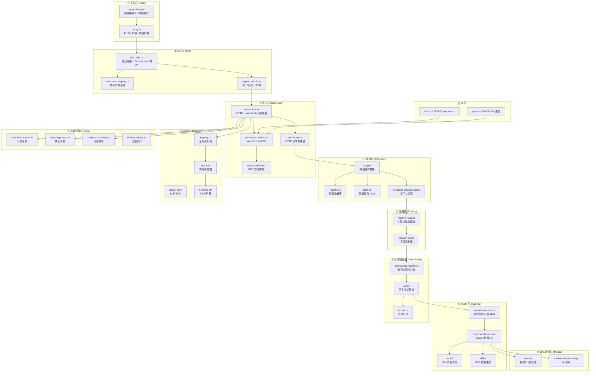
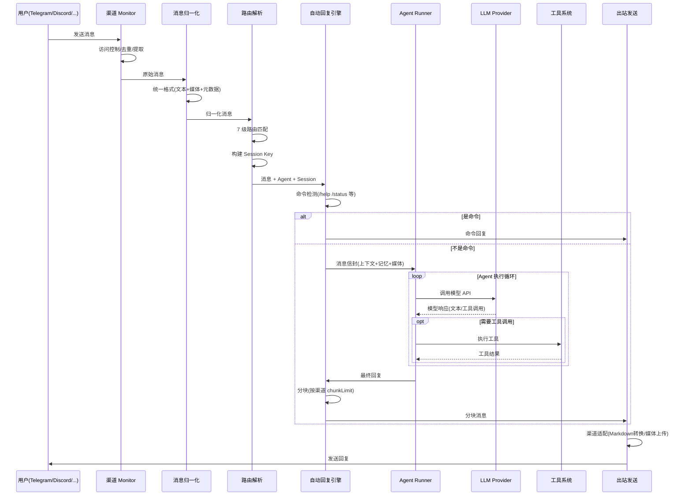
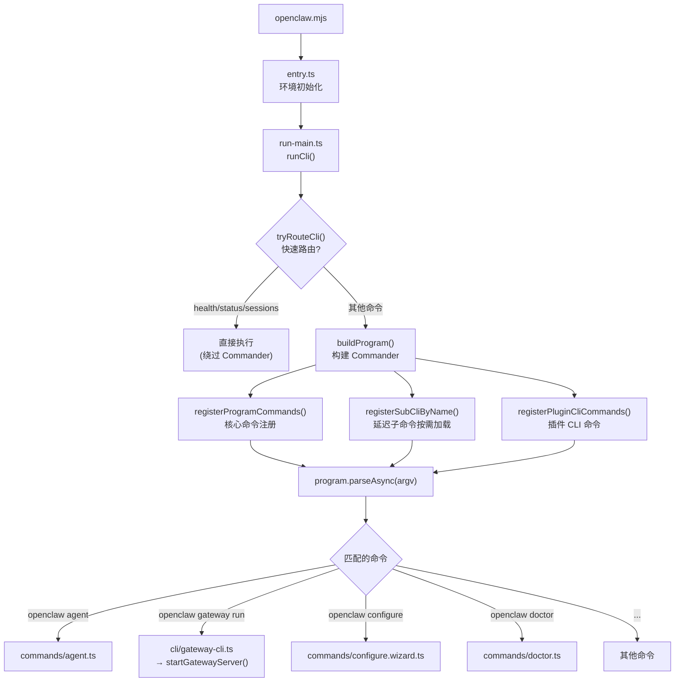
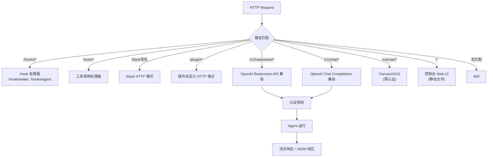
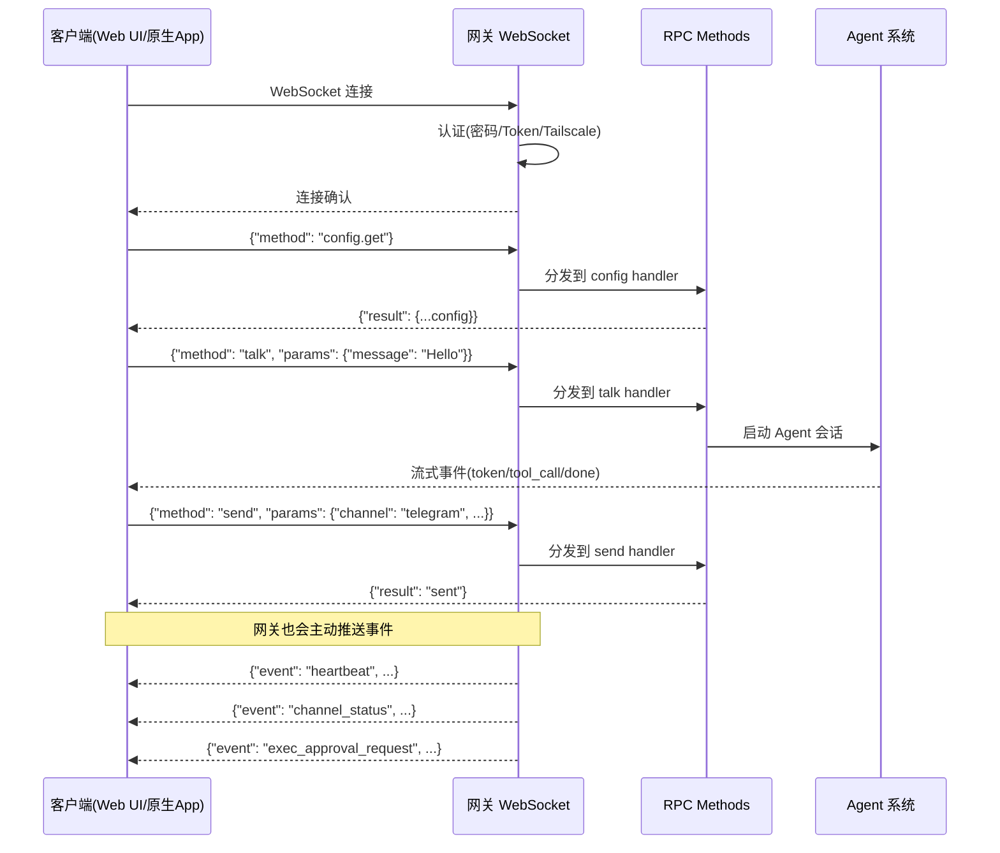
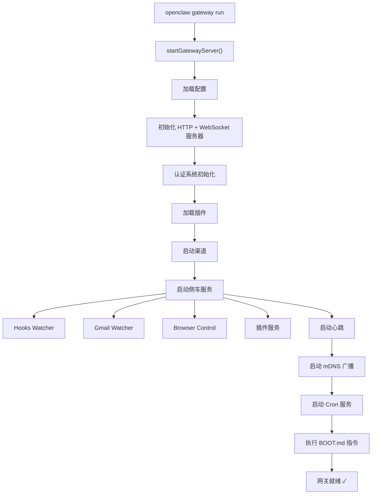
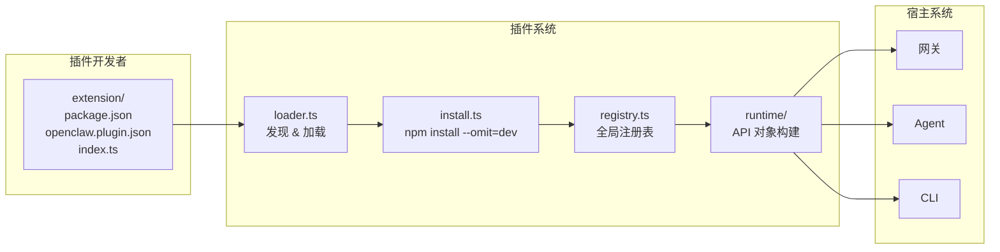

# OpenClaw 项目架构深度分析

> 本文档面向希望理解并复刻类似系统的开发者，系统性地剖析 OpenClaw 的架构设计、模块边界、数据流和扩展机制。

---

## 目录

1. [项目定位与核心能力](#1-项目定位与核心能力)
2. [技术栈全景](#2-技术栈全景)
3. [分层架构设计](#3-分层架构设计)
4. [详细目录结构](#4-详细目录结构)
5. [核心数据流与交互逻辑](#5-核心数据流与交互逻辑)
6. [插件系统机制](#6-插件系统机制)
7. [路由与会话管理](#7-路由与会话管理)
8. [配置系统](#8-配置系统)
9. [构建与发布](#9-构建与发布)
10. [如果你要复刻：架构决策参考](#10-如果你要复刻架构决策参考)

---

## 1. 项目定位与核心能力

### 1.1 什么是 OpenClaw

OpenClaw 是一个 **多渠道 AI Agent 网关平台**。它的核心角色是作为各种聊天平台（Telegram、Discord、Slack、WhatsApp、Signal、iMessage、LINE 等 19+ 渠道）与 AI/LLM 模型（Anthropic Claude、OpenAI GPT、Google Gemini、GitHub Copilot、通义千问等）之间的 **智能桥梁**。

简单来说：用户在任意聊天平台发送消息 → OpenClaw 网关接收 → 路由到正确的 AI Agent → Agent 处理并生成回复 → 回复发送回原始平台。

### 1.2 核心能力矩阵

| 能力域 | 具体能力 |
|--------|----------|
| **多渠道集成** | 7 个核心渠道 + 27 个扩展渠道（通过插件），统一抽象层 |
| **多 Agent 管理** | 多 Agent 并存、Agent 绑定路由、独立会话/记忆/配置 |
| **多模型支持** | Anthropic/OpenAI/Google/Copilot/Bedrock/MiniMax/通义千问等，支持认证轮转与降级 |
| **工具系统** | Bash 执行、浏览器自动化、文件编辑、Web 搜索、图像处理等 50+ 内置工具 |
| **插件化架构** | 完整的 Plugin SDK，支持注册工具/渠道/Provider/Hook/HTTP 端点/CLI 命令等 |
| **媒体处理** | 图像/音频/视频的上传、存储、AI 理解（OCR/转录/分析） |
| **记忆系统** | 基于向量数据库的长期记忆，支持语义搜索 |
| **安全机制** | 沙箱隔离、执行审批（人在回路）、SSRF 防护、API Key 脱敏 |
| **多设备** | Bonjour/mDNS 服务发现、设备配对、远程节点管理 |
| **多入口** | CLI、Web UI（Lit）、macOS/iOS/Android 原生应用 |

### 1.3 运行模式

```
┌─────────────────────────────────────────────────────┐
│                    用户访问入口                        │
│  CLI 命令行 │ Web 控制台 │ macOS App │ iOS/Android App  │
└──────┬──────┴─────┬──────┴─────┬─────┴──────┬────────┘
       │            │            │            │
       ▼            ▼            ▼            ▼
┌─────────────────────────────────────────────────────┐
│               OpenClaw Gateway（网关）                │
│         WebSocket RPC + HTTP API + mDNS              │
└──────────────────────┬──────────────────────────────┘
                       │
       ┌───────────────┼───────────────┐
       ▼               ▼               ▼
   渠道监听         Agent 运行       插件服务
 (Telegram/        (模型调用/        (Hook/
  Discord/          工具执行/         自定义
  Slack/...)        回复生成)         扩展)
```

---

## 2. 技术栈全景

### 2.1 核心运行时

| 组件 | 选型 | 版本 | 说明 |
|------|------|------|------|
| **运行时** | Node.js | ≥22.12.0 | ESM 模式，启用编译缓存 |
| **语言** | TypeScript | 5.9.x | strict 模式，target ES2023 |
| **模块系统** | ESM | NodeNext | `"type": "module"` |
| **包管理** | pnpm | 10.23.0 | monorepo workspace |

### 2.2 构建工具链

| 工具 | 用途 | 说明 |
|------|------|------|
| **tsdown** (0.20.3) | TypeScript 打包 | 基于 rolldown，6 个 bundle 入口 |
| **Vite** (7.3.1) | UI 构建 | 用于 Lit Web Components UI |
| **oxlint** | Lint | 带 type-aware 模式 |
| **oxfmt** | 格式化 | Rust 实现，高性能 |
| **vitest** (4.0.18) | 测试 | fork 池模式，覆盖率阈值 70% |

### 2.3 核心依赖

| 依赖 | 用途 |
|------|------|
| `commander` (14.x) | CLI 框架 |
| `grammy` (1.40.x) | Telegram Bot API |
| `@buape/carbon` (0.14.0) | Discord Bot |
| `@slack/bolt` (4.6.x) | Slack Bot (Socket Mode) |
| `@whiskeysockets/baileys` (7.0.0-rc.9) | WhatsApp Web |
| `@line/bot-sdk` (10.6.x) | LINE Bot |
| `@larksuiteoapi/node-sdk` (1.58.x) | 飞书/Lark |
| `express` (5.2.x) | HTTP 服务器 |
| `sharp` (0.34.x) | 图像处理 |
| `playwright-core` (1.58.x) | 浏览器自动化 |
| `@sinclair/typebox` (0.34.x) | JSON Schema / 类型验证 |
| `zod` (4.3.x) | 运行时数据校验 |
| `lit` (3.3.x) | Web Components UI |
| `marked` (17.x) | Markdown 渲染 |

### 2.4 原生应用

| 平台 | 语言 | 构建工具 |
|------|------|----------|
| macOS | Swift | SwiftPM (Package.swift) |
| iOS | Swift | XcodeGen (project.yml) + Fastlane |
| Android | Kotlin | Gradle (build.gradle.kts) |
| 共享层 | Swift | OpenClawKit 跨 iOS/macOS |

---

## 3. 分层架构设计

### 3.1 架构总览

OpenClaw 采用 **11 层分层架构**，每层有明确的职责边界：



### 3.2 各层职责详解

#### ① 入口层 (Entry)

**职责**：进程引导，环境标准化

| 文件 | 职责 |
|------|------|
| `openclaw.mjs` | Node.js shebang 入口，启用 `--experimental-compile-cache`，import `dist/entry.js` |
| `src/entry.ts` | 设置进程标题、抑制实验性警告、解析 `--profile` 标志、可能 respawn 进程、调用 `runCli()` |

**关键设计**：
- 编译缓存加速冷启动
- Profile 隔离：支持多套配置并行（`--profile <name>`）
- 进程 respawn：如果当前进程未带 `--disable-warning`，会 respawn 一个新进程

#### ② CLI 层 (CLI)

**职责**：命令行界面框架，命令注册与分发

**两级命令注册模式**：

```
核心命令（立即加载）              延迟子命令（按需加载）
├── setup                       ├── gateway
├── onboard                     ├── daemon
├── configure                   ├── models
├── config                      ├── plugins
├── agent                       ├── channels
├── message                     ├── hooks
├── memory                      ├── tui
├── maintenance                 ├── logs
├── status/health/sessions      ├── security
└── browser                     ├── cron
                                ├── dns
                                ├── ...共 31 个
                                └── completion
```

**快速路由机制**：`route.ts` 中的 `tryRouteCli()` 识别热路径命令（`health`、`status`、`sessions`），绕过完整的 Commander 解析流程，直接执行，加速响应。

#### ③ 网关层 (Gateway)

**职责**：核心通信中枢，提供 HTTP API + WebSocket RPC 服务

**HTTP 请求处理链（优先级从高到低）**：

```
HTTP Request
  ├─① /hooks/*           → Hook 请求（wake/agent/自定义映射）
  ├─② /tools/*           → 工具调用
  ├─③ /slack/*            → Slack HTTP 模式
  ├─④ /plugin/*           → 插件自定义 HTTP 端点
  ├─⑤ /v1/responses/*     → OpenAI Responses API 兼容
  ├─⑥ /v1/chat/*          → OpenAI Chat Completions 兼容
  ├─⑦ /canvas/*           → Canvas/A2UI（需认证）
  ├─⑧ /*                  → 控制台 Web UI
  └─⑨                     → 404
```

**WebSocket RPC**：客户端连接后，通过 JSON 消息调用网关方法（config/send/talk/skills/wizard/exec-approval 等）。

#### ④ 渠道层 (Channels)

**职责**：多聊天平台的统一抽象

**渠道能力模型**：每个渠道声明自己的能力（`ChannelDock`），系统根据能力进行差异化处理：

```typescript
// dock.ts 中的能力声明示例
{
  chatTypes: ["direct", "group", "channel", "thread"],
  polls: boolean,          // 是否支持投票
  reactions: boolean,      // 是否支持反应/表情
  media: boolean,          // 是否支持媒体
  nativeCommands: boolean, // 是否支持原生斜杠命令
  threads: boolean,        // 是否支持线程
  blockStreaming: boolean,  // 是否阻塞流式输出
  outbound: {
    chunkLimit: number,     // 单条消息最大长度
    chunkType: "chars" | "bytes",
  }
}
```

**7 个核心渠道** + **27 个扩展渠道**：

| 核心渠道 | SDK/库 | 说明 |
|----------|--------|------|
| Telegram | Grammy | Bot API，支持 webhook/polling |
| WhatsApp | Baileys | Web 协议，QR 扫码登录 |
| Discord | Carbon SDK | Bot API，斜杠命令/线程 |
| Google Chat | HTTP webhook | Workspace Chat API |
| Slack | Bolt | Socket Mode + HTTP |
| Signal | signal-cli REST | 通过 REST API 对接 |
| iMessage | BlueBubbles | macOS 原生 |

#### ⑤ 路由层 (Routing)

**职责**：将入站消息路由到正确的 Agent

**7 级优先级路由**（从高到低）：

```
Level 1: binding.peer         → 精确匹配对话对象（如特定用户/群组）
Level 2: binding.peer.parent  → 线程父对象匹配
Level 3: binding.guild        → Discord Guild 级匹配
Level 4: binding.team         → Slack Team 级匹配
Level 5: binding.account      → 账号级匹配
Level 6: binding.channel      → 渠道级通配符匹配
Level 7: default              → 默认 Agent
```

#### ⑥ Agent 层 (Agents)

**职责**：AI Agent 的运行时环境

**核心流程**：
1. **模型选择** (`model-selection.ts`)：根据 Agent 配置选择 Provider + Model
2. **认证** (`model-auth.ts`)：获取对应 Provider 的认证凭据（API Key/OAuth/Device Code）
3. **降级** (`model-fallback.ts`)：主模型不可用时自动降级到备选
4. **运行** (`pi-embedded-runner/`)：调用 LLM API，执行工具调用，生成回复
5. **压缩** (`compaction.ts`)：会话过长时自动压缩

**默认配置**：
- Provider: `anthropic`
- Model: `claude-opus-4-6`
- Context: `200,000` tokens

#### ⑦ 自动回复层 (Auto-Reply)

**职责**：消息处理管线，从接收到回复的完整流程

```
入站消息
  → 命令检测（是否为 /command 格式）
    → 是：命令分发（内置命令 / 插件命令）
    → 否：进入 Agent 回复流程
      → 消息信封封装（附加上下文、记忆、媒体理解结果）
      → Agent Runner 执行（模型调用 + 工具执行循环）
      → 回复分块（按渠道 chunkLimit 切分）
      → 出站发送（通过渠道适配器）
```

#### ⑧ 插件层 (Plugins)

**职责**：可扩展的插件注册与管理

插件可注册 **8 种扩展类型**：
1. `registerTool()` — Agent 工具
2. `registerChannel()` — 聊天渠道
3. `registerProvider()` — AI Provider
4. `registerHook()` — 事件钩子
5. `registerHttpHandler()` / `registerHttpRoute()` — HTTP 端点
6. `registerCli()` — CLI 子命令
7. `registerService()` — 后台服务
8. `registerCommand()` — 聊天命令（绕过 LLM 直接响应）

#### ⑨ 基础设施层 (Infra)

**职责**：底层基础能力

| 子系统 | 说明 |
|--------|------|
| 心跳 | 定时广播网关状态，客户端存活检测 |
| 执行审批 | 工具调用前需人类审批（人在回路），支持多渠道审批转发 |
| 设备发现 | Bonjour/mDNS 协议，局域网内自动发现网关实例 |
| 设备配对 | Ed25519 密钥交换，设备身份认证 |
| 端口管理 | 端口检测、冲突解决 |
| SSRF 防护 | 媒体下载时的 IP/域名校验 |
| TLS | 网关 HTTPS 证书管理 |

#### ⑩ 媒体管道层 (Media)

**职责**：媒体文件的全生命周期管理

```
媒体输入（聊天平台/URL/文件）
  → 安全下载（SSRF 防护 + 超时控制）
  → MIME 检测 + 存储（本地文件系统，5MB 上限，2 分钟 TTL）
  → 图像处理（sharp：缩放/裁剪/格式转换）
  → AI 理解（可选）
    ├── 图像 → Anthropic/OpenAI/Google Vision
    ├── 音频 → Deepgram/Groq/MiniMax 转录
    └── 视频 → Google 视频理解
  → 理解结果注入到 Agent 上下文
```

#### ⑪ UI 层

**Web 控制台**（Lit Web Components）：
- 聊天界面、渠道管理、Agent 配置、网关状态、执行审批、日志查看
- 通过 WebSocket 连接网关

**原生应用**：
- macOS：菜单栏应用，管理网关生命周期
- iOS/Android：移动端管理界面

---

## 4. 详细目录结构

### 4.1 根目录

```
openclaw/
├── openclaw.mjs              # CLI bin 入口（Node.js shebang）
├── package.json              # 项目配置，65+ 脚本
├── tsconfig.json             # TypeScript 配置（strict, ES2023, NodeNext）
├── tsdown.config.ts          # 构建配置（6 个 bundle 入口）
├── pnpm-workspace.yaml       # monorepo 工作区定义
├── vitest.config.ts          # 测试配置（fork 池，70% 覆盖率）
├── vitest.*.config.ts        # 专项测试配置（e2e/extensions/gateway/live/unit）
├── docker-compose.yml        # Docker 编排
├── Dockerfile*               # Docker 镜像（主/sandbox/sandbox-browser）
├── fly.toml / fly.private.toml  # Fly.io 部署
├── render.yaml               # Render 部署
├── CHANGELOG.md              # 变更日志
├── AGENTS.md / CLAUDE.md     # AI Agent 指引
│
├── src/                      # 核心源码（~2500 个 TS 文件）
├── ui/                       # Web 控制台 UI（Lit + Vite）
├── apps/                     # 原生应用（macOS/iOS/Android）
├── extensions/               # 34 个扩展插件
├── packages/                 # 内部共享包
├── scripts/                  # 构建/测试/运维脚本（~68 个）
├── docs/                     # 文档（Mintlify）
├── test/                     # 集成测试
├── vendor/                   # 第三方 vendored 代码
├── patches/                  # pnpm 补丁
├── assets/                   # 静态资源
├── skills/                   # 技能定义
├── git-hooks/                # Git 钩子
└── Swabble/                  # Swabble 子项目
```

### 4.2 `src/` 核心源码目录

#### 入口与全局

| 文件/目录 | 文件数 | 职责 |
|-----------|--------|------|
| `entry.ts` | 1 | CLI 引导入口：进程标题、警告抑制、profile 切换 |
| `index.ts` | 1 | 库主入口：loadConfig/monitorWebChannel/getReplyFromConfig 等 |
| `runtime.ts` | 1 | `RuntimeEnv` 类型定义（log/error/exit 标准接口） |
| `globals.ts` | 1 | 全局状态标志（verbose/yes 模式）和主题化日志辅助 |
| `extensionAPI.ts` | 1 | 对外导出的扩展 API（agent 路径、model 默认值等） |
| `version.ts` | 1 | 版本管理 |
| `utils.ts` | 1 | 通用工具函数（路径、E164 格式化、JID 转换等） |
| `logger.ts` / `logging.ts` | 2 | 顶层日志工具 |

#### CLI 基础设施

| 目录 | 文件数 | 职责 |
|------|--------|------|
| `cli/` | ~181 | CLI 命令行界面基础设施 |
| `cli/run-main.ts` | — | CLI 核心编排：dotenv → 环境标准化 → 快速路由 → Commander 构建 → 解析执行 |
| `cli/route.ts` | — | 快速路由（health/status/sessions 热路径直接执行） |
| `cli/argv.ts` | — | 参数解析工具（getPrimaryCommand/hasFlag/getFlagValue） |
| `cli/deps.ts` | — | CLI 依赖注入容器 |
| `cli/program/build-program.ts` | — | Commander 程序构建 |
| `cli/program/command-registry.ts` | — | 核心命令注册（10 个立即加载的命令） |
| `cli/program/register.subclis.ts` | — | 延迟子命令注册（31 个按需加载） |
| `cli/progress.ts` | — | 进度条（osc-progress + @clack/prompts spinner） |
| `cli/*-cli.ts` | — | 各子命令的 CLI 封装（browser/channels/config/cron/daemon/gateway/hooks/logs/memory/models/plugins/security/skills 等） |

#### 命令实现

| 目录 | 文件数 | 职责 |
|------|--------|------|
| `commands/` | ~243 | 所有用户命令的具体业务逻辑 |
| `commands/agent.ts` (17.7KB) | — | 核心 Agent 命令 |
| `commands/configure.wizard.ts` (18.5KB) | — | 交互式配置向导 |
| `commands/doctor.ts` (10.6KB) | — | 系统诊断、状态迁移、安全检查 |
| `commands/auth-choice.apply.api-providers.ts` (31.3KB) | — | 多 Provider 认证流程（Anthropic/OpenAI/Copilot/Google/xAI/MiniMax 等 10+） |
| `commands/gateway-status.ts` (12.6KB) | — | 网关状态查询与展示 |
| `commands/agents.commands.add.ts` (11.1KB) | — | 添加新 Agent |
| `commands/onboard*.ts` | — | 新用户引导流程 |

#### 网关服务器

| 目录 | 文件数 | 职责 |
|------|--------|------|
| `gateway/` | ~206 | 核心 WebSocket/HTTP 网关服务器 |
| `gateway/server.impl.ts` (639行) | — | 网关核心实现：依赖注入组装所有子系统 |
| `gateway/server-http.ts` (451行) | — | HTTP 请求处理链（8 级优先级） |
| `gateway/server-ws-runtime.ts` | — | WebSocket 连接管理和 RPC 方法分发 |
| `gateway/server-methods/` | — | RPC 方法实现（config/send/talk/skills/wizard/exec-approval 等） |
| `gateway/server-channels.ts` | — | 渠道启停和运行时快照 |
| `gateway/server-chat.ts` (11.9KB) | — | Agent 事件处理、会话管理 |
| `gateway/server-startup.ts` | — | 侧车服务启动（hooks/gmail/browser/插件） |
| `gateway/server-cron.ts` | — | 定时任务服务 |
| `gateway/server-discovery*.ts` | — | Bonjour/mDNS 服务发现 |
| `gateway/server-plugins.ts` | — | 网关插件加载 |
| `gateway/boot.ts` | — | 启动流程，加载 BOOT.md 指令 |
| `gateway/client.ts` (13.8KB) | — | 网关 WebSocket 客户端 |
| `gateway/auth.ts` (7.9KB) | — | 认证（密码/Token/Tailscale） |
| `gateway/openai-http.ts` (11KB) | — | OpenAI Chat Completions 兼容接口 |
| `gateway/openresponses-http.ts` (26.9KB) | — | OpenAI Responses API 兼容接口 |
| `gateway/protocol/` | — | 协议定义 |

#### 渠道系统

| 目录 | 文件数 | 职责 |
|------|--------|------|
| `channels/` | ~112 | 多渠道统一抽象层 |
| `channels/registry.ts` | — | 渠道注册表（7 核心渠道顺序、别名、元数据） |
| `channels/dock.ts` (455行) | — | 渠道 Dock（能力声明/分块策略/线程/提及） |
| `channels/plugins/` | ~112 | 渠道插件抽象系统 |
| `channels/plugins/types.core.ts` | — | 核心类型（ChannelPlugin/ChannelMeta/ChannelSetupInput 等） |
| `channels/plugins/types.plugin.ts` | — | 插件适配器接口（20+ 个） |
| `channels/plugins/catalog.ts` | — | 渠道插件目录 |
| `channels/plugins/normalize/` | — | 各渠道消息归一化（discord/telegram/signal/slack/whatsapp/imessage） |
| `channels/plugins/onboarding/` | — | 各渠道配置向导 |
| `channels/plugins/outbound/` | — | 出站消息处理 |
| `channels/plugins/actions/` | — | 渠道操作（反应/置顶等） |

#### 各平台渠道实现

| 目录 | 文件数 | SDK/库 | 职责 |
|------|--------|--------|------|
| `telegram/` | ~85 | Grammy | Bot API, webhook/polling, 贴纸缓存, 内联按钮, 语音处理 |
| `discord/` | ~42 | Carbon SDK | 消息监听, 斜杠命令, 线程, Pluralkit 集成 |
| `slack/` | ~34 | Bolt | Socket Mode + HTTP, 消息线程, 渠道/用户解析 |
| `web/` | ~81 | Baileys | WhatsApp Web 实现, QR 登录, 媒体处理, 广播/群组 |
| `signal/` | ~22 | signal-cli REST | SSE 事件流, daemon 模式 |
| `imessage/` | ~14 | BlueBubbles | macOS 原生, 消息监控/发送 |
| `line/` | ~34 | LINE Bot SDK | Webhook, Flex Message, Rich Menu |

#### Agent 系统

| 目录 | 文件数 | 职责 |
|------|--------|------|
| `agents/` | ~477 | **最大模块**，AI Agent 运行时 |
| `agents/defaults.ts` | — | 默认配置（Provider/Model/Tokens） |
| `agents/model-selection.ts` | — | 模型选择逻辑 |
| `agents/model-auth.ts` | — | Provider 认证凭据获取 |
| `agents/model-fallback.ts` | — | 模型降级策略 |
| `agents/auth-profiles/` | — | 多认证配置管理（API Key/OAuth/Device Code，轮转+冷却） |
| `agents/pi-embedded-runner/` | — | Pi Agent 嵌入式运行器（核心执行引擎） |
| `agents/cli-runner/` | — | CLI 模式的 Agent 运行器 |
| `agents/bash-tools.exec.ts` (53KB) | — | Bash 工具执行核心（Agent 调用终端命令） |
| `agents/tools/` | — | Agent 工具注册（bash/file-edit/search/browser/message/notebook 等 50+） |
| `agents/skills/` | — | 技能系统（MCP 工具集成） |
| `agents/sandbox.ts` / `sandbox-paths.ts` | — | 沙箱隔离配置 |
| `agents/compaction.ts` | — | 会话自动压缩 |
| `agents/memory-search.ts` | — | 记忆检索 |
| `agents/agent-scope.ts` | — | Agent 作用域管理 |
| `agents/schema/` | — | TypeBox Schema 定义 |

#### 自动回复系统

| 目录 | 文件数 | 职责 |
|------|--------|------|
| `auto-reply/` | ~212 | 消息处理管线核心 |
| `auto-reply/commands-registry.ts` (14.5KB) | — | 命令注册系统 |
| `auto-reply/commands-registry.data.ts` (16.9KB) | — | 内置命令注册表 |
| `auto-reply/chunk.ts` (501行) | — | 消息分块处理 |
| `auto-reply/status.ts` (20.5KB) | — | 状态报告 |
| `auto-reply/reply/` | — | Agent 回复管线 |
| `auto-reply/reply/agent-runner-execution.ts` (25.4KB) | — | Agent 执行核心 |
| `auto-reply/dispatch*.ts` | — | 消息分发 |

#### 路由系统

| 目录 | 文件数 | 职责 |
|------|--------|------|
| `routing/` | 5 | 消息路由核心 |
| `routing/resolve-route.ts` | — | 7 级优先级路由解析 |
| `routing/session-key.ts` | — | 会话键构建（agent+channel+account+peer） |
| `routing/bindings.ts` | — | Agent 绑定规则解析 |

#### 插件系统

| 目录 | 文件数 | 职责 |
|------|--------|------|
| `plugins/` | ~40 | 插件生命周期管理 |
| `plugins/registry.ts` (516行) | — | 全局注册表（8 种扩展类型） |
| `plugins/types.ts` (538行) | — | 完整的插件 API 类型定义 |
| `plugins/loader.ts` (14KB) | — | 插件发现与加载 |
| `plugins/install.ts` (16.4KB) | — | 插件安装（npm install --omit=dev） |
| `plugins/runtime/` | — | 插件运行时（API 对象构建） |
| `plugin-sdk/` | 2 | 对外 SDK（re-export 公共类型和工具函数） |

#### 配置系统

| 目录 | 文件数 | 职责 |
|------|--------|------|
| `config/` | ~139 | 配置读写与校验 |
| `config/schema.ts` (54.5KB) | — | 完整配置 Schema（所有字段的类型+校验+默认值） |
| `config/io.ts` (18.7KB) | — | 配置 I/O（读取 JSON5、写入、环境变量替换、include 支持） |
| `config/defaults.ts` (12.2KB) | — | 默认配置值 |
| `config/config.ts` | — | 配置加载入口 |
| `config/migration/` | — | 遗留配置迁移（3 阶段） |

#### 基础设施

| 目录 | 文件数 | 职责 |
|------|--------|------|
| `infra/` | ~199 | 底层基础能力 |
| `infra/heartbeat-runner.ts` (33KB) | — | 心跳系统（定时广播+存活检测） |
| `infra/exec-approvals.ts` (41KB) | — | 执行审批（人在回路） |
| `infra/bonjour-discovery.ts` (16.5KB) | — | mDNS/Bonjour 服务发现 |
| `infra/device-pairing.ts` (15.3KB) | — | 设备配对流程 |
| `infra/device-identity.ts` / `device-auth-store.ts` | — | 设备身份与认证存储 |
| `infra/ports.ts` / `ports-inspect.ts` | — | 端口检测与冲突管理 |
| `infra/net/ssrf.ts` | — | SSRF 防护 |
| `infra/tls/` | — | TLS 网关证书 |
| `infra/provider-usage.*.ts` | — | 各 Provider API 用量追踪 |
| `infra/env.ts` / `dotenv.ts` | — | 环境变量管理 |
| `infra/fs-safe.ts` / `json-file.ts` | — | 安全文件操作 |
| `infra/outbound/` | — | 出站消息投递 |

#### 媒体管道

| 目录 | 文件数 | 职责 |
|------|--------|------|
| `media/` | 20 | 媒体存储与处理 |
| `media/store.ts` | — | 本地存储（5MB 上限，2 分钟 TTL，UUID 文件名） |
| `media/fetch.ts` | — | 安全下载（SSRF 防护） |
| `media/mime.ts` | — | MIME 类型检测 |
| `media/image-ops.ts` (13KB) | — | 图像操作（sharp） |
| `media/server.ts` | — | 媒体 HTTP 服务 |
| `media-understanding/` | ~21 | AI 媒体理解 |
| `media-understanding/runner.ts` (37KB) | — | 核心理解运行器 |
| `media-understanding/providers/` | — | 多 Provider（Anthropic/OpenAI/Google/Groq/Deepgram/MiniMax） |

#### 记忆系统

| 目录 | 文件数 | 职责 |
|------|--------|------|
| `memory/` | 43 | 长期记忆 |
| `memory/index-manager.ts` (76KB) | — | Memory Index Manager（最大单文件） |
| `memory/qmd-manager.ts` (31KB) | — | QMD 管理器 |
| `memory/embeddings/` | — | 向量嵌入（OpenAI/Gemini/Voyage 三种 Provider） |
| `memory/sqlite-vec/` | — | SQLite-vec 向量存储 |
| `memory/hybrid-search.ts` | — | 混合搜索（向量+关键词） |

#### Hook 系统

| 目录 | 文件数 | 职责 |
|------|--------|------|
| `hooks/` | ~44 | 事件驱动的 Hook |
| `hooks/install.ts` (14.9KB) | — | Hook 安装 |
| `hooks/workspace.ts` | — | Hook 工作区管理 |
| `hooks/bundled/` | — | 4 个内置 Hook（boot-md/command-logger/session-memory/soul-evil） |
| `hooks/gmail-setup-utils.ts` (11KB) | — | Gmail Hook 设置 |

#### 其他模块

| 目录 | 文件数 | 职责 |
|------|--------|------|
| `sessions/` | 7 | 会话策略（发送策略/model 覆盖/日志级别/标签） |
| `security/` | 13 | 安全审计与修复（audit.ts 36.5KB + audit-extra.ts 43.6KB） |
| `logging/` | 15 | 结构化日志（tslog, 脱敏, 子系统日志） |
| `terminal/` | 12 | 终端 UI 原子组件（ANSI/表格/进度/主题/调色板） |
| `tui/` | 28 | 交互式 TUI（基于 pi-tui，ChatLog/编辑器/命令/流式组装） |
| `cron/` | ~46 | 定时任务（CronService, 调度/存储/交付） |
| `daemon/` | 30 | 守护进程（launchd/systemd/schtasks 三平台） |
| `browser/` | ~82 | 浏览器自动化（Playwright + CDP, Profile/截图/交互） |
| `tts/` | 2 | 语音合成（Edge TTS + AI 模型 TTS，45.8KB） |
| `acp/` | 13 | Agent Communication Protocol 网关 |
| `canvas-host/` | 5 | Canvas 文件托管（HTTP + WebSocket live-reload） |
| `web/` | ~81 | WhatsApp Web 实现 |
| `wizard/` | 12 | 引导向导（clack UI, onboarding 流程） |
| `process/` | ~4 | 进程管理（exec, 子进程桥接） |
| `markdown/` | ~3 | Markdown 解析/围栏检测 |
| `providers/` | ~3 | Provider 辅助工具（Copilot auth, 千问 OAuth, Google 共享逻辑） |

### 4.3 `extensions/` 扩展插件

共 34 个独立插件包，每个包含 `package.json` + `openclaw.plugin.json` + `index.ts`：

| 类别 | 插件 |
|------|------|
| **消息渠道** (19) | `telegram`, `discord`, `slack`, `signal`, `whatsapp`, `imessage`, `googlechat`, `line`, `feishu`, `matrix`, `mattermost`, `msteams`, `nextcloud-talk`, `nostr`, `twitch`, `tlon`, `zalo`, `zalouser`, `bluebubbles` |
| **认证** (4) | `google-antigravity-auth`, `google-gemini-cli-auth`, `minimax-portal-auth`, `qwen-portal-auth` |
| **AI/LLM** (3) | `llm-task`, `lobster`, `copilot-proxy` |
| **语音** (2) | `talk-voice`, `voice-call` |
| **记忆** (2) | `memory-core`, `memory-lancedb` |
| **设备** (2) | `device-pair`, `phone-control` |
| **其他** (2) | `diagnostics-otel`, `open-prose` |

### 4.4 `ui/` Web 控制台

```
ui/
├── package.json              # Lit 3.3 + Vite 7.3
├── vite.config.ts
├── index.html
└── src/
    ├── main.ts               # 入口
    ├── styles.css             # 全局样式
    ├── styles/                # 组件样式（37KB）、配置样式（26KB）、布局（10KB）
    └── ui/
        ├── app.ts (20KB)          # 主应用组件
        ├── app-render.ts (54KB)   # 渲染逻辑
        ├── app-chat.ts            # 聊天界面
        ├── app-channels.ts        # 渠道管理
        ├── app-gateway.ts         # 网关状态
        ├── app-settings.ts (13KB) # 设置页面
        ├── types.ts (17KB)        # UI 类型定义
        ├── gateway.ts (9KB)       # 网关通信
        ├── navigation.ts          # 导航
        ├── controllers/           # MVC 控制器
        ├── views/                 # 视图组件
        ├── components/            # 可复用组件
        └── chat/                  # 聊天消息渲染
```

### 4.5 `apps/` 原生应用

```
apps/
├── android/          # Kotlin, Gradle
│   ├── app/
│   │   ├── build.gradle.kts
│   │   └── src/main/java/...
│   └── gradle/
├── ios/              # Swift, XcodeGen
│   ├── project.yml
│   ├── Sources/
│   ├── Tests/
│   └── fastlane/
├── macos/            # Swift, SwiftPM
│   ├── Package.swift
│   └── Sources/OpenClaw/
└── shared/           # OpenClawKit（跨 iOS/macOS）
    └── Sources/OpenClawKit/
```

### 4.6 `scripts/` 构建脚本

| 类别 | 示例 |
|------|------|
| 构建打包 | `package-mac-app.sh`, `create-dmg.sh`, `codesign-mac-app.sh`, `notarize-mac-artifact.sh` |
| 测试 | `test-parallel.mjs`, `test-install-sh-docker.sh`, `test-force.ts` |
| 文档 | `build-docs-list.mjs`, `docs-link-audit.mjs`, `docs-i18n/` |
| 发布 | `release-check.ts`, `changelog-to-html.sh`, `make_appcast.sh` |
| Docker | `docker/`, `sandbox-setup.sh`, `sandbox-browser-entrypoint.sh` |
| 协议生成 | `protocol-gen.ts`, `protocol-gen-swift.ts` |
| 移动端 | `termux-auth-widget.sh`, `termux-quick-auth.sh` |

---

## 5. 核心数据流与交互逻辑

### 5.1 入站消息处理链（主要数据流）

这是 OpenClaw 最核心的数据流 —— 从聊天平台收到消息到回复用户的完整路径：



**关键文件路径**：
```
各渠道 Monitor (telegram/bot-handlers.ts, discord/monitor/*, slack/monitor/*)
  → channels/plugins/normalize/* (消息归一化)
  → routing/resolve-route.ts (路由解析)
  → auto-reply/dispatch*.ts (消息分发)
  → auto-reply/commands-registry.ts (命令检测)
  → auto-reply/reply/agent-runner-execution.ts (Agent 执行)
  → auto-reply/chunk.ts (消息分块)
  → channels/plugins/outbound/* (出站适配)
  → 各渠道 send (telegram/send.ts, discord/send.*.ts, slack/send.ts)
```

### 5.2 CLI 命令分发流程



### 5.3 HTTP 请求处理链



### 5.4 WebSocket RPC 交互



### 5.5 网关启动序列



---

## 6. 插件系统机制

### 6.1 插件架构总览



### 6.2 插件清单文件

每个插件需提供 `openclaw.plugin.json`：

```json
{
  "name": "discord",
  "displayName": "Discord",
  "version": "1.0.0",
  "main": "index.ts",
  "kind": "channel",
  "capabilities": ["channel"]
}
```

### 6.3 插件注册 API

插件通过 `register(api)` 回调获得 `OpenClawPluginApi` 对象：

```typescript
// 插件入口示例 (extensions/discord/index.ts)
const plugin = {
  id: "discord",
  name: "Discord",
  configSchema: emptyPluginConfigSchema(),
  register(api: OpenClawPluginApi) {
    // 注册渠道
    api.registerChannel({ plugin: discordPlugin });

    // 注册工具
    api.registerTool({ name: "discord-send", factory: (ctx) => [...] });

    // 注册 Hook
    api.registerHook({
      name: "on-message",
      entry: "message_received",
      register: (hook) => { ... }
    });

    // 注册 HTTP 端点
    api.registerHttpRoute({
      path: "/discord/webhook",
      method: "POST",
      handler: async (req, res) => { ... }
    });

    // 注册 CLI 命令
    api.registerCli((program) => {
      program.command("discord:status").action(() => { ... });
    });

    // 注册后台服务
    api.registerService({
      name: "discord-bot",
      start: async () => { ... },
      stop: async () => { ... }
    });

    // 注册聊天命令（绕过 LLM）
    api.registerCommand({
      name: "ping",
      handler: async (msg) => "pong"
    });

    // 生命周期事件
    api.on("gateway_start", () => { ... });
    api.on("gateway_stop", () => { ... });
  }
};
export default plugin;
```

### 6.4 全局注册表

`plugins/registry.ts` 维护所有已注册的扩展：

```typescript
// 注册表结构
{
  plugins: Map<string, PluginInstance>,
  tools: ToolRegistration[],
  hooks: HookRegistration[],
  channels: ChannelRegistration[],
  providers: ProviderRegistration[],
  gatewayHandlers: GatewayHandlerRegistration[],
  httpHandlers: HttpHandlerRegistration[],
  httpRoutes: HttpRouteRegistration[],
  cliRegistrars: CliRegistrarRegistration[],
  services: ServiceRegistration[],
  commands: CommandRegistration[],
  diagnostics: DiagnosticRegistration[],
}
```

### 6.5 生命周期 Hook 事件

插件可监听 **14 种事件**：

| 事件 | 触发时机 |
|------|----------|
| `before_agent_start` | Agent 开始运行前 |
| `agent_end` | Agent 运行结束后 |
| `before_compaction` | 会话压缩前 |
| `after_compaction` | 会话压缩后 |
| `message_received` | 收到入站消息 |
| `message_sending` | 即将发送出站消息 |
| `message_sent` | 出站消息发送完成 |
| `before_tool_call` | 工具调用前 |
| `after_tool_call` | 工具调用后 |
| `tool_result_persist` | 工具结果持久化时 |
| `session_start` | 会话开始 |
| `session_end` | 会话结束 |
| `gateway_start` | 网关启动 |
| `gateway_stop` | 网关停止 |

### 6.6 插件隔离

- 每个插件在独立目录，通过 `npm install --omit=dev` 安装依赖
- 运行时通过 `jiti` 别名解析 `openclaw/plugin-sdk` 路径
- 插件的 `dependencies` 不应使用 `workspace:*`（npm install 会破坏）
- `openclaw` 应放在 `devDependencies` 或 `peerDependencies`

---

## 7. 路由与会话管理

### 7.1 路由解析

路由系统决定一条入站消息应该被哪个 Agent 处理。配置中的 Agent 绑定（bindings）定义了路由规则。

**7 级优先级**（从高到低）：

```
Level 1: binding.peer
  → 精确匹配对话对象（如特定用户 ID 或群组 ID）
  → 最高优先级，用于将特定对话绑定到特定 Agent

Level 2: binding.peer.parent
  → 线程父对象匹配
  → 用于 Discord/Slack 的线程场景

Level 3: binding.guild
  → Discord Guild（服务器）级匹配

Level 4: binding.team
  → Slack Team（工作区）级匹配

Level 5: binding.account
  → 账号级匹配（如特定 Bot Token 对应的账号）

Level 6: binding.channel
  → 渠道级通配符匹配（如所有 Telegram 消息路由到同一 Agent）

Level 7: default
  → 默认 Agent（无绑定匹配时的回退）
```

### 7.2 Session Key 构建

Session Key 是会话的唯一标识，由四个维度组成：

```
SessionKey = agent + channel + account + peer

示例:
  agent: "default"
  channel: "telegram"
  account: "bot123456"
  peer: "user789"
  → SessionKey: "default:telegram:bot123456:user789"
```

Session Key 决定了：
- 会话历史的存储位置
- 记忆的关联范围
- 模型选择的上下文

### 7.3 Agent 绑定配置示例

```json5
{
  "agents": {
    "coder": {
      "model": "claude-opus-4-6",
      "bindings": [
        { "channel": "discord", "guild": "123456" },
        { "channel": "telegram", "peer": "user789" }
      ]
    },
    "assistant": {
      "model": "gpt-4o",
      "bindings": [
        { "channel": "slack", "team": "T0123" }
      ]
    }
  },
  "defaultAgent": "assistant"
}
```

---

## 8. 配置系统

### 8.1 配置文件格式

OpenClaw 使用 **JSON5** 格式的配置文件（支持注释和尾逗号），存储在 `~/.openclaw/config.json5`。

### 8.2 配置 Schema

`config/schema.ts`（54.5KB）定义了完整的配置 Schema，使用 TypeBox 进行校验。主要配置域：

| 配置域 | 说明 |
|--------|------|
| `gateway` | 网关设置（端口/绑定/模式/密码/TLS） |
| `agents` | Agent 定义（模型/Provider/工具/系统提示/bindings） |
| `defaultAgent` | 默认 Agent 名称 |
| `channels` | 各渠道配置（Token/认证/选项） |
| `hooks` | Hook 配置 |
| `memory` | 记忆系统配置（Provider/嵌入模型） |
| `security` | 安全策略 |
| `media` | 媒体处理配置 |
| `cron` | 定时任务 |
| `plugins` | 插件配置 |

### 8.3 配置加载流程

```
1. 读取 ~/.openclaw/config.json5（JSON5 解析）
2. 处理 include 指令（支持拆分配置到多个文件）
3. 环境变量替换（${ENV_VAR} 语法）
4. 遗留配置迁移（3 阶段迁移策略）
5. Schema 校验（TypeBox validate）
6. 合并默认值
7. 返回类型安全的配置对象
```

### 8.4 配置热重载

网关运行时支持配置热重载：
- 文件系统监听配置文件变更
- 变更后重新加载并校验
- 通过 WebSocket 通知已连接的客户端

---

## 9. 构建与发布

### 9.1 tsdown 构建入口

6 个独立的 bundle，每个对应不同的使用场景：

| 入口 | 输出 | 用途 |
|------|------|------|
| `src/index.ts` | `dist/index.js` | 库主入口（作为 npm 包导入） |
| `src/entry.ts` | `dist/entry.js` | CLI 入口（`openclaw.mjs` 导入） |
| `src/infra/warning-filter.ts` | `dist/infra/warning-filter.js` | Node.js 实验性警告过滤 |
| `src/plugin-sdk/index.ts` | `dist/plugin-sdk/index.js` | 插件 SDK（供插件开发者使用） |
| `src/extensionAPI.ts` | `dist/extensionAPI.js` | 扩展 API |
| `src/hooks/bundled/*/handler.ts` | `dist/hooks/bundled/*/handler.js` | 内置 Hook（glob 匹配） |

### 9.2 Monorepo 结构

```
工作区包:
├── .                   (根) openclaw 主包
├── ui/                 openclaw-control-ui
├── packages/clawdbot/  clawdbot
├── packages/moltbot/   moltbot
└── extensions/*/       34 个扩展插件包
```

### 9.3 npm 包导出

```json
{
  "exports": {
    ".": "./dist/index.js",
    "./plugin-sdk": "./dist/plugin-sdk/index.js",
    "./cli-entry": "./openclaw.mjs"
  }
}
```

### 9.4 发布渠道

| 渠道 | 说明 |
|------|------|
| **stable** | 标签发布 `vYYYY.M.D`，npm dist-tag `latest` |
| **beta** | 预发布 `vYYYY.M.D-beta.N`，npm dist-tag `beta` |
| **dev** | `main` 分支最新（无标签，git checkout） |

### 9.5 协议同步

原生应用与 TypeScript 核心共享协议定义：

```
protocol:gen       → 生成 JSON Schema
protocol:gen:swift → 生成 Swift 模型代码
protocol:check     → 校验一致性
```

---

## 10. 如果你要复刻：架构决策参考

### 10.1 必须实现的核心模块

如果你要实现类似系统，以下是按优先级排序的核心模块：

1. **配置系统** — 一切的基础，定义好 Schema
2. **渠道抽象层** — 定义统一的渠道接口（归一化/出站/能力声明）
3. **路由系统** — 消息到 Agent 的映射规则
4. **Agent 运行时** — 模型调用 + 工具执行循环
5. **网关服务器** — HTTP + WebSocket，渠道管理
6. **CLI 框架** — 用户交互入口
7. **插件系统** — 可扩展性的基础

### 10.2 关键架构模式

| 模式 | OpenClaw 的做法 | 建议 |
|------|----------------|------|
| **渠道抽象** | ChannelDock 能力声明 + 标准化适配器接口 | 定义统一的 `ChannelPlugin` 接口，让每个渠道自声明能力 |
| **命令注册** | 两级注册（核心立即 + 子命令延迟） | 延迟加载显著改善 CLI 启动速度 |
| **路由** | 多级优先级 binding 匹配 | 简化可从 2-3 级开始（peer → channel → default） |
| **插件隔离** | 独立目录 + npm install + jiti 别名 | 每个插件独立安装依赖避免冲突 |
| **认证** | 多 Provider 多 Profile 轮转 | 支持至少 API Key + OAuth 两种 |
| **消息分块** | 按渠道 chunkLimit 自动切分 | 不同平台消息长度限制差异大，必须处理 |
| **执行审批** | 人在回路（HITL） | Agent 执行危险操作前需用户确认 |
| **配置格式** | JSON5（支持注释） | 比纯 JSON 友好，支持 include 拆分 |

### 10.3 建议的简化路径

如果你想快速搭建 MVP：

```
阶段 1：单渠道 + 单 Agent
  - 1 个渠道（如 Telegram）
  - 1 个 Agent（固定模型）
  - 基本配置加载
  - CLI 启动

阶段 2：多渠道 + 路由
  - 渠道抽象层
  - 2-3 级路由
  - 消息归一化

阶段 3：插件化
  - Plugin SDK
  - Hook 系统
  - 渠道作为插件

阶段 4：完整功能
  - 多 Agent + 多模型
  - 记忆系统
  - 媒体处理
  - Web UI
  - 原生应用
```

### 10.4 技术选型建议

| 组件 | OpenClaw 选型 | 替代选项 |
|------|--------------|----------|
| 运行时 | Node.js 22+ | Bun / Deno |
| 语言 | TypeScript (ESM) | — |
| CLI | Commander | yargs / oclif / citty |
| HTTP | Express 5 | Fastify / Hono / H3 |
| WebSocket | ws (Node built-in) | Socket.io / uWebSockets |
| 构建 | tsdown | tsup / esbuild / rollup |
| 测试 | Vitest | Jest |
| UI | Lit (Web Components) | React / Vue / Svelte |
| 包管理 | pnpm (monorepo) | npm workspaces / turborepo |
| Schema | TypeBox + Zod | 只用 Zod / AJV |
| 日志 | tslog | pino / winston |

---

> 本文档基于 OpenClaw v2026.2.9 源码分析生成，涵盖了项目的核心架构设计、完整目录结构和关键数据流。如有疑问或需要更深入分析某个模块，请告知。
