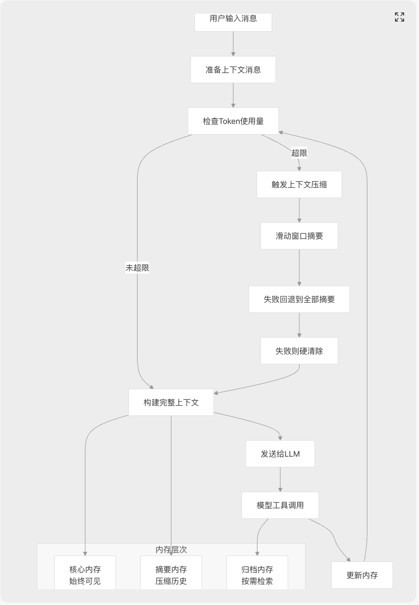
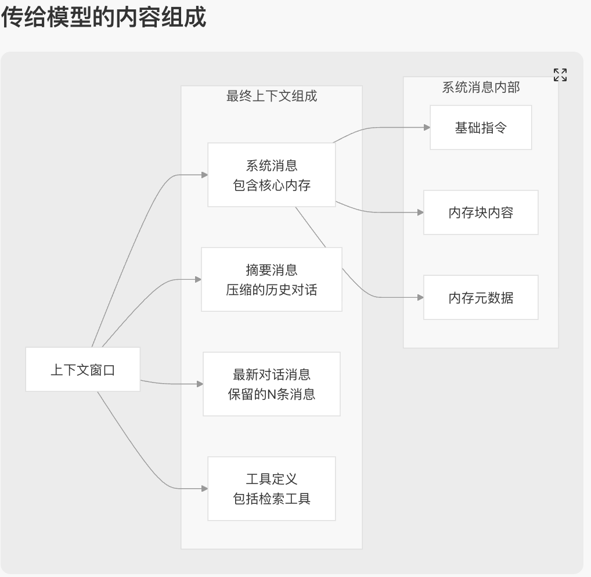
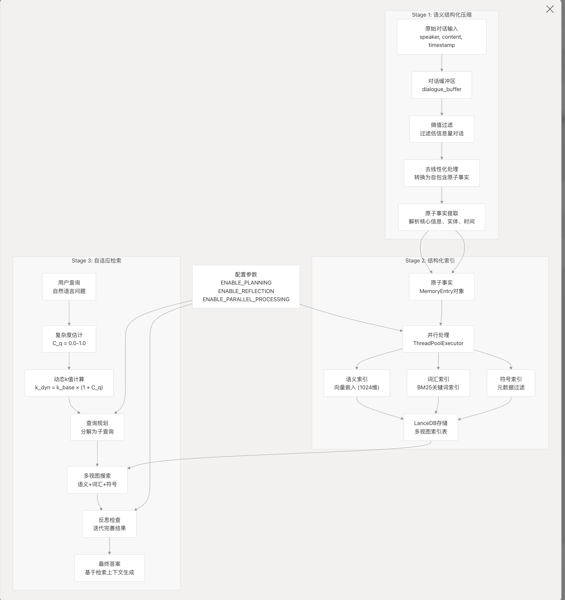

## Letta （memGPT）
执行流程 
- 分层管理：核心内存、归档内存、会话窗口（摘要+最新N条信息）
- 上下文管理过程：在多轮交互中，模型通过工具调用会自动往核心内存与归档内存中写入相关信息。同时会自动检查会话窗口是否达到可以摘要的条件，如果触发摘要后，会将原对话中的历史消息生成摘要替换窗口内的历史消息（此处会保留最新的n条对话消息）。 下一次交互时，会将核心内存的完整信息以及会话窗口中的摘要+最新n条消息，一起给到模型。同时提供归档内容检索工具，让模型按需检索归档内容。
- 内容组成：

## SimpleMem
执行流程

### 潜在风险
- 信息存储与查询目标潜在不对齐风险
- 缺乏元数据对齐机制：
  - 查询生成时无法直接获取存储的实体/关键词分布
  - 没有基于存储内容的查询约束机制
  - 两个 LLM 调用之间缺乏信息传递