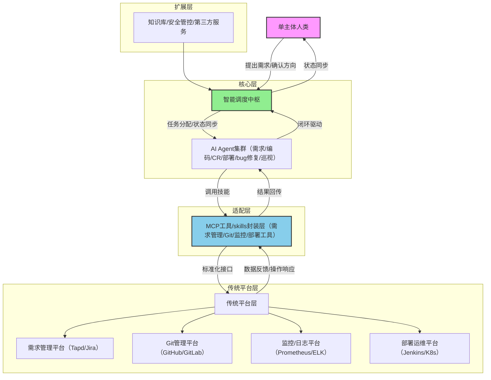

# 智驱单主体：人+智能体协同开发愿景之传统平台的融入

# 一、摘要

本报告聚焦“一人即军团”的软件开发新模式，提出以“智能调度中枢”为核心、“AI Agent集群”为执行载体、“传统平台适配层”为支撑的技术架构，构建从需求触发、迭代开发到上线运维的全流程自动化闭环。报告重点阐述传统系统平台（需求管理、Git、监控/日志等）在不改动原有架构的前提下，通过MCP（Multi-Platform Connector）工具/技能封装实现Agent接入的方案，同时设计生态建设路径与愿景，为单人主体实现高效、规模化软件开发提供技术参考与落地指引。

# 二、引言

## 2.1 背景与动因

传统软件开发依赖多角色协作（产品、研发、测试、运维），存在沟通成本高、流程冗余、资源依赖强等问题，制约了单人主体的创业效率与创新空间。随着大模型与AI Agent技术的成熟，Agent具备自主决策、跨任务协作能力，为一人公司打破角色壁垒提供了可能。同时，企业存量传统平台承载核心业务数据与流程，无法轻易替换，如何实现传统平台与智能Agent生态的无缝融合，成为新模式落地的关键痛点。

## 2.2 核心目标

1. 构建“单主体+AI Agent”的全自动化开发闭环，实现需求从提出到上线的无人干预流转（人类仅负责需求确认与方向把控）。

2. 建立传统平台适配机制，通过MCP工具/skills封装，让现有需求管理、Git、监控日志平台无需架构改造即可接入智能生态。

3. 设计分层生态体系，支撑需求分类管理、Agent能力扩展、跨平台协同，具备可复用、可迭代的扩展能力。

# 三、核心架构设计

## 3.1 架构整体框架

本架构采用“四层三阶”设计，四层为生态分层（核心层、适配层、传统平台层、扩展层），三阶为流程闭环（需求生命周期、开发运维周期、异常处理周期），整体以“智能调度中枢”为核心枢纽，实现全链路协同。

## 3.2 核心层：智能调度中枢与Agent集群

### 3.2.1 智能调度中枢

作为架构核心，承担任务分配、状态同步、数据流转、规则校验四大职能，采用事件驱动模式联动各组件，核心模块包括：

- 需求分类引擎：基于语义识别与规则匹配，将需求划分为“未明确原始需求”“已确认完整需求”“待分析bug”“已明确bug”四类，分配对应处理路径。

- Agent调度模块：维护Agent能力注册表，根据任务类型（需求梳理、编码、CR、部署、bug修复）分配最优Agent，支持Agent协同（如编码Agent与测试Agent联动）。

- 状态管理模块：实时同步需求、任务、平台的状态数据（如需求从“未明确”到“已上线”的全生命周期追踪），确保闭环一致性。

- 规则引擎：配置流程规则（如CR不通过触发编码Agent优化）、权限控制（Agent对传统平台的操作权限）、异常兜底策略（如Agent执行失败通知人类介入）。

### 3.2.2 AI Agent集群

按专业场景划分Agent类型，各Agent通过调用适配层MCP工具实现与传统平台的交互，核心Agent包括：

- 需求梳理Agent：承接未明确原始需求，通过多轮交互补全信息，生成结构化需求包，同步至传统需求管理平台。

- 编码Agent：接收已确认需求，调用Git平台MCP技能拉取代码、提交PR，自主完成编码、单元测试。

- CR Agent：监听Git平台PR事件，调用代码审查工具与Git MCP技能，生成审查报告，驱动编码Agent优化。

- 部署Agent：通过运维平台MCP技能，执行打包、灰度发布、全量上线，同步部署状态至监控平台。

- bug诊断与修复Agent：接收待分析bug，调用监控/日志平台MCP技能定位根因，升级为已明确bug后执行修复，联动Git与部署平台完成迭代。

- 现网巡视Agent：实时调用监控平台MCP技能抓取指标，识别异常后自动生成bug工单，触发闭环。

## 3.3 适配层：MCP工具/skills封装层

作为传统平台与Agent集群的桥梁，核心目标是在不改动传统平台架构的前提下，提供标准化接入能力，采用“工具封装+技能注册”模式设计，核心组件包括：

### 3.3.1 MCP工具封装

针对各类传统平台，封装标准化操作工具，屏蔽平台接口差异，提供统一调用入口，支持同步/异步交互，核心工具示例：

|传统平台类型|MCP工具核心能力|接入方式|技能标识|
|---|---|---|---|
|需求管理平台（Tapd/Jira）|需求创建/更新/状态同步、工单生成、需求包导入导出|REST API封装|req-mgmt-skill-v1|
|Git管理平台（GitHub/GitLab）|代码拉取/提交、PR创建/审核、分支管理、代码对比|Git API + WebHook封装|git-ops-skill-v1|
|监控/日志平台（Prometheus/ELK）|指标抓取、日志查询、异常告警推送、链路追踪|HTTP API + 日志流封装|monitor-log-skill-v1|
|部署运维平台（Jenkins/K8s）|任务触发、打包构建、容器调度、回滚操作|CLI命令封装 + K8s API|deploy-ops-skill-v1|
### 3.3.2 技能注册与管理

建立MCP技能注册表，Agent通过技能标识调用对应工具，支持技能版本迭代、权限管控与调用日志审计。同时提供技能扩展框架，允许新增传统平台（如测试管理平台、知识库平台）的MCP工具，无需改动核心架构，保障生态扩展性。

## 3.4 传统平台层：存量系统支撑

复用现有需求管理、Git、监控/日志、部署运维等平台，通过适配层MCP工具开放能力，保留原有数据存储、权限管理、业务逻辑，避免重复建设与数据迁移成本。传统平台承担核心数据持久化、人工应急操作入口功能，与智能生态形成互补——日常流程由Agent通过MCP工具自动化执行，特殊场景（如重大故障兜底、权限变更）可通过传统平台人工干预。

## 3.5 扩展层：生态能力补充

为核心架构提供增值能力，包括：

- 知识库模块：存储行业需求模板、代码规范、故障处理案例，为Agent提供决策支撑。

- 安全管控模块：对Agent调用MCP工具的操作进行审计，防止越权访问，保障代码与数据安全。

- 第三方服务接入：通过MCP技能扩展，接入天气API、支付接口等第三方服务，支撑业务场景落地。

# 四、全流程闭环设计

## 4.1 需求生命周期闭环

1. 触发阶段：人类提出原始需求（或现网巡视Agent生成bug工单、外部平台Issue触发），调度中枢接收后分类标记。

2. 完善阶段：需求梳理Agent通过MCP工具同步需求至管理平台，多轮交互补全信息，升级为已确认需求。

3. 执行阶段：调度中枢分配编码Agent，通过Git MCP工具完成开发，联动CR Agent校验质量。

4. 上线阶段：部署Agent通过运维MCP工具执行发布，同步状态至监控平台。

5. 迭代阶段：现网巡视Agent监控运行状态，发现异常生成bug工单，重复“诊断-修复-上线”流程。

## 4.2 异常处理闭环（bug生命周期）

1. 发现与录入：现网巡视Agent调用监控MCP工具识别异常，生成待分析bug工单，录入需求管理平台。

2. 诊断与升级：bug诊断Agent调用日志/链路工具定位根因，升级为已明确bug，分配修复Agent。

3. 修复与验证：修复Agent完成编码，通过CR校验后，由部署Agent上线，监控平台验证修复效果。

4. 归档：修复验证通过后，工单状态更新为“已闭环”，案例同步至知识库。

# 五、生态愿景设计

## 5.1 生态愿景图

图1 智驱单主体一人软件开发公司生态愿景图

## 5.2 生态核心特征

- 去中心化协作：无多角色依赖，单主体主导+Agent自主协作，流程高效无内耗。

- 传统与智能融合：存量平台无需改造即可接入，保护既有投资，降低落地门槛。

- 高度可扩展：通过MCP技能框架，支持新增Agent类型、传统平台、第三方服务，适配多样化业务场景。

- 低门槛复用：Agent能力与MCP工具可跨项目复用，单主体可同时运营多个软件产品，实现规模化创业。

## 5.3 生态演进路径

1. 初级阶段（1.0）：实现核心流程自动化，适配主流传统平台（Git、Tapd、Prometheus），支撑单一产品开发闭环。

2. 中级阶段（2.0）：扩展Agent能力（如AI设计Agent、用户运营Agent），完善MCP技能生态，支持多产品并行开发。

3. 高级阶段（3.0）：构建Agent能力市场，支持第三方Agent与MCP技能接入，形成开放生态，单主体可按需调用外部能力，打破技术边界。

# 六、挑战与应对策略

## 6.1 核心挑战

- 技能标准化难题：不同传统平台接口差异大，MCP工具需适配多平台，维护成本高。

- Agent决策精度：复杂需求（如跨模块业务逻辑）或极端bug场景，Agent可能出现决策偏差。

- 数据安全风险：Agent通过MCP工具访问传统平台，存在越权操作、数据泄露风险。

- 兼容性问题：部分老旧传统平台无开放接口，难以接入MCP适配层。

## 6.2 应对策略

- 建立MCP技能标准规范：定义统一的技能接口与数据格式，降低多平台适配成本，支持技能版本迭代。

- 引入人类兜底机制：对高复杂度需求、Agent决策存疑场景，自动暂停流程通知人类介入，结合知识库优化Agent决策模型。

- 强化安全管控：实施细粒度权限分配（Agent仅拥有最小操作权限），全流程操作日志审计，定期安全巡检。

- 老旧平台适配方案：对无开放接口的平台，通过轻量化中间件（如屏幕抓取、脚本代理）实现能力封装，逐步替换为可开放接口的平台。

# 七、结论与展望

## 7.1 结论

本报告提出的“核心层+适配层+传统平台层+扩展层”架构，通过智能调度中枢联动Agent集群，依托MCP工具/skills封装层实现传统平台无改造接入，构建了全流程自动化闭环，有效解决了一人软件开发的角色壁垒与传统平台适配难题。该架构兼具落地性与扩展性，既能复用现有系统资源，又能随着AI技术演进持续升级，为单人主体实现规模化软件开发提供了可行路径。

## 7.2 展望

随着多模态大模型、Agent协同协议的成熟，未来一人软件开发生态将实现更深度的智能化：Agent具备跨场景复杂决策能力，可自主优化开发流程；MCP技能生态形成开放市场，实现能力按需调用；传统平台与智能生态的融合更无缝，推动“一人公司”成为软件开发领域的重要形态，打破创业门槛，激发更多细分场景的创新活力。
> （注：文档部分内容可能由 AI 生成）